author: VaiVoa
summary: Publicação no Readme.io a partir de um arquivo OpenAPI/Swagger
id: docs
categories: codelabs,markdown
environments: Web
status: Published
feedback link: https://github.com/Vaivoa/doc-api-readme-swagger/issues
<!-- (Abordagem 1 - Publicação no Readme.io a partir de um arquivo OpenAPI/Swagger) -->

# Readme: Documentação de APIs a partir de um arquivo Swagger.

## Antes de Começar

Duration: 1:28

Já encerrou o desenvolvimento de suas APIs e precisou apresentar os resultados para algumas dessas pessoas? 

- Cliente;
- Novos desenvolvedores que precisam entender a regra de negócio, ou mesmo para a
- Comunidade externa, de maneira pública.

Com certeza a resposta será “sim” para pelo menos um desses. Então vem a sua mente usar o Swagger, e é isso, lá já temos os *endpoints,* com os verbos HTTP, os tipos de parâmetros, até mesmo autenticação. E sim, essa é uma ferramenta incrível, não temos dúvida. 

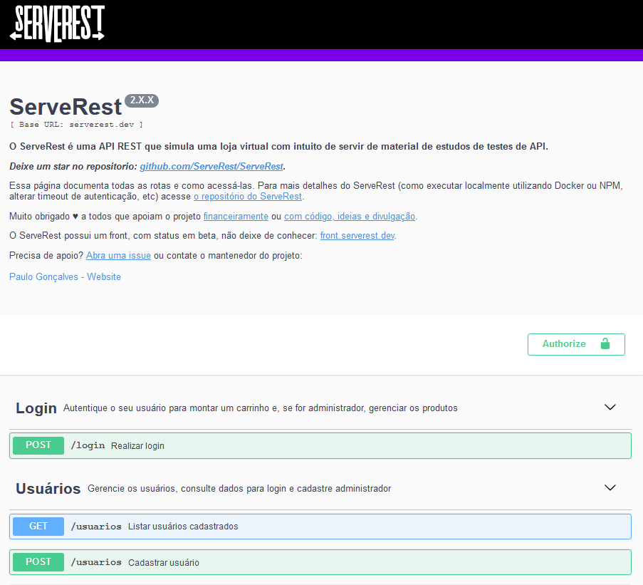

Mas e se você quisesse deixar claro a regra de negócio da sua API? Se fosse do seu interesse que quem estivesse fazendo chamadas para sua aplicação entendesse o porquê das coisas? Já sei, você pensaria em criar um blog explicando esses pontos? Ok, compreensível, mas lá do seu blog você permitirá que sejam feitas requisições para sua API? 

Aqui temos uma alternativa que facilita a apresentação do backend de maneira mais amigável, possibilita a geração de requisições para seus endpoints em diversas linguagens de programação e ainda fornece métricas sobre a utilização de sua documentação. Essa alternativa chama-se Readme. Nunca ouviu falar? Não tem problema, você vai poder acompanhar o tutorial mesmo assim.

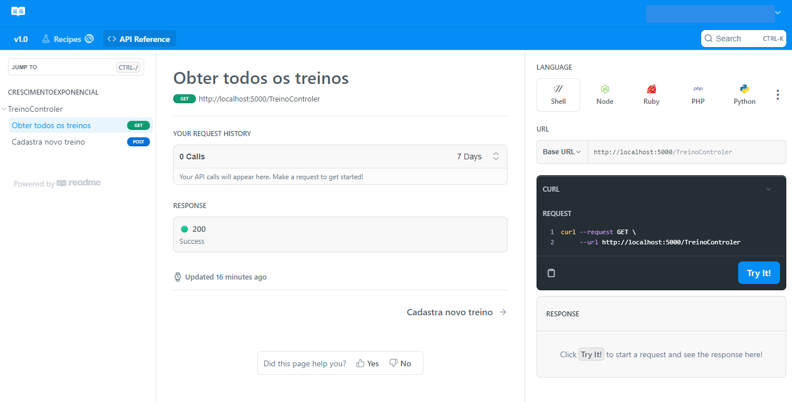

Neste tutorial vamos aprender à fazer a publicação da documentação da sua API no Readme manualmente. Para isso vamos usar um projeto open source como exemplo, portanto você vai conseguir seguir o passo a passo para o caso de já ter um projeto pronto.

E aí, ficou animado? Então vamos lá!


### O que você vai criar

- Uma documentação no Readme de um projeto à partir de um arquivo de documentação Swagger ou OpenAPI.

### O que você vai aprender

- Configuração inicial do Readme.
- Criação e customização de páginas de documentação.
- Personalizar o layout de sua documentação.
- Explorar recursos avançados do Readme.

### O que é necessário
- Conhecimento básico de editores de texto.
- Um projeto existente com um arquivo de documentação Swagger ou OpenAPI.


## O Projeto

Muitas vezes nos deparamos com projetos que já possuem alguma documentação, mas nem sempre com uma apresentação tão amigável a quem não é desenvolvedor. Para estes casos, o [Readme](https://readme.com/) pode ser um bom aliado, já que além de documentação dos endpoints, permite

- testar endpoints
- inserir exemplos de request e response
- inserir textos explicativos com imagens e links

Além de poder monitorar quais endpoints estão sendo mais buscados e que erros o usuários estão gerando ao fazer request. Provendo valiosos *insights* sobre pontos a serem melhorados.

Para demonstrar a configuração e uso das ferramentas do [Readme](https://readme.com/), usaremos o projeto **ServeRest.**

O ServeRest é uma API REST que simula uma loja virtual com intuito de servir de material de estudos de testes de API. É um projeto open source disponível no repositório [GitHub](https://github.com/ServeRest/ServeRest) e [online](https://serverest.dev/)

[Repositório do ServeRest](https://github.com/ServeRest/ServeRest)

Este projeto foi escolhido como estudo de caso por ser uma API relativamente pequena que permite explorar bem as ferramentas do [Readme](https://readme.com/) além de já possuir alguma documentação em arquivo Swagger.

<aside>
⚠️ Para esta abordagem, é IMPRESCINDÍVEL que se tenha um arquivo de documentação Swagger ou OpenAPI em formato `.json` ou `.yaml`.

Caso não possua este arquivo, avance para a próxima abordagem, onde será explicado como configurar o Swagger em um projeto para que este arquivo seja gerado automaticamente.

</aside>

Caso queira testar primeiramente a API sem ter que rodar localmente, acesse o [link](https://serverest.dev/). Nele é possível testar os endpoint através da documentação feita pelo Swagger, como na figura abaixo.

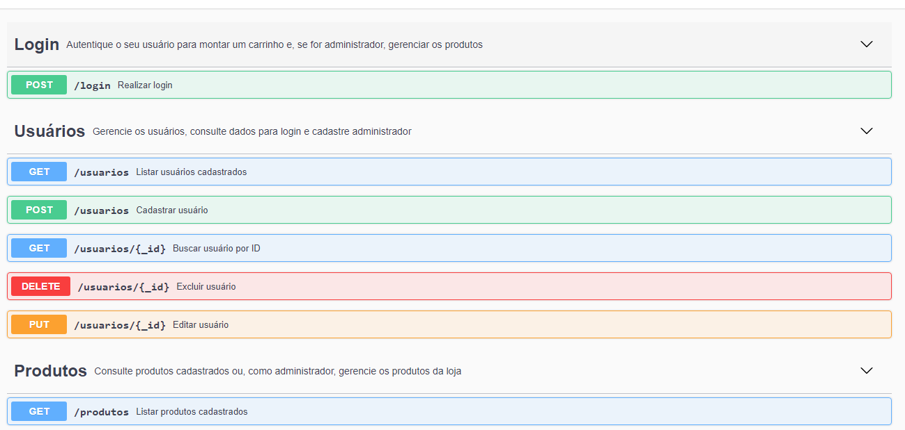

Apesar de ser comum para um desenvolvedor, muitas vezes essa documentação não é intuitiva para um cliente ou até mesmo outros membros da equipe. Por isso, mostraremos nos próximos passos como melhorar esta apresentação.


## Primeiros Setups do Readme

Primeiramente, precisamos de uma conta na plataforma. Neste curso, utilizaremos a opção gratuita mesmo, que já atende às nossas necessidades.

Acesse [readme.com](http://readme.com) e realize o cadastro, caso não possua conta:

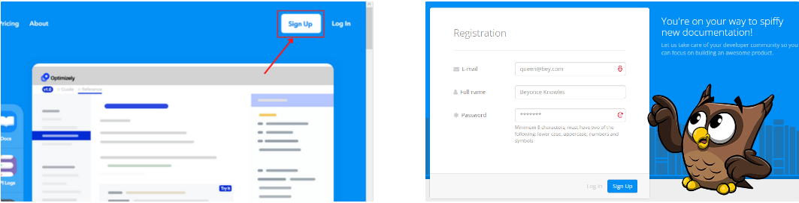

Já na página seguinte, é possível realizar as primeiras configurações de seu primeiro projeto:

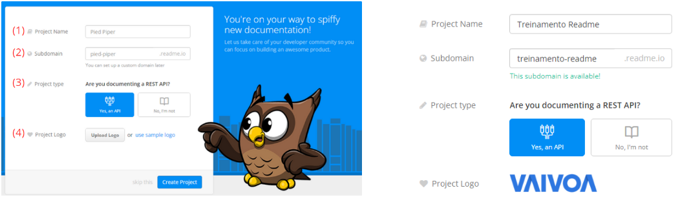

Escolhendo o nome do projeto (1); um subdomínio para o fácil acesso do cliente (2); o tipo do projeto (3), já que a plataforma permite a documentação não só de APIs REST; e até uma logo personalizada que será disposta no canto superior esquerdo.

Agora temos acesso à página de projeto. Com isso, podemos fazer o upload do arquivo Swagger/OpenAPI.

Clicando em “*Dashboard*” no menu à esquerda (1), depois em “*Import Your API*” (2) e por fim em “*OpenAPI Upload*” (3):


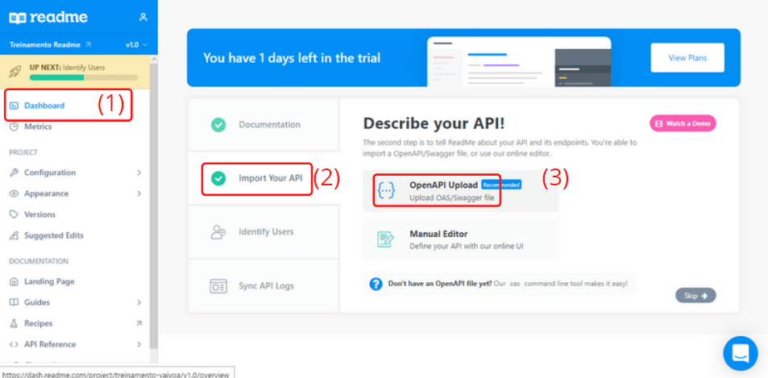

Ou, seguindo outro caminho, clicamos em “*API Reference*” (1), depois em “*+ API*” (2) e por fim em “*OpenAPI Upload*” (3):


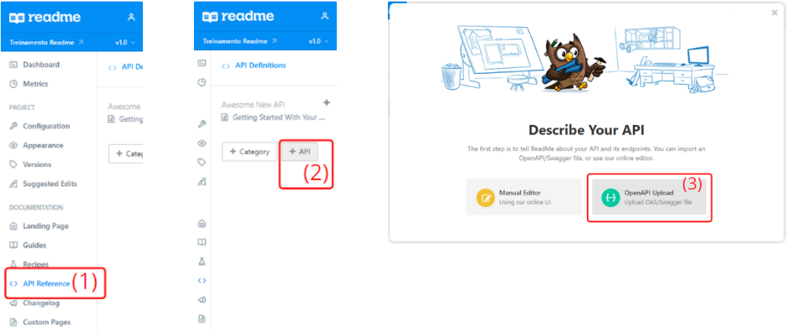

Note que, podemos posteriormente fazer o upload de outras APIs, desde que cliquemos em “*+ API*”.

Ambos os caminhos expostos levam à página de upload, onde escolheremos em nossa máquina o arquivo Swagger que desejamos:


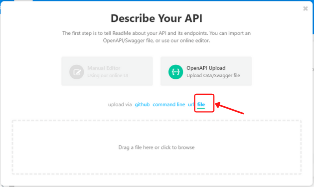

## Observações quanto ao arquivo Swagger e o domínio da API

No projeto em questão (ServeRest), temos o arquivo Swagger no caminho `./docs/swagger.json`, partindo da raiz do projeto.

Nas primeiras linhas deste arquivo, temos a tag `"host": "localhost:3000"`. Esta tag faz sentido quando queremos testar a API localmente, porém, o Readme não tem acesso à máquina local. 

Portanto, devemos modificar esta linha para `"host": "serverest.dev"` ou algum outro domínio online para que possamos testar a resposta dos endpoints depois.

```json
{
  "swagger": "2.0",
  "info": {
    "description": "**O ServeRest é uma API REST que simula uma loja virtual com intuito de servir de material de estudos de testes de API.**\n\n_**Deixe um star no repositório: [github.com/ServeRest/ServeRest](https://github.com/ServeRest/ServeRest).**_\n\nCaso vá utilizar para teste de carga leia a seção '[Teste de Carga](https://github.com/ServeRest/ServeRest#teste-de-carga)'.\n\nEssa página documenta todas as rotas e como acessá-las. Para mais detalhes do ServeRest (como executar localmente utilizando Docker ou NPM, alterar timeout de autenticação, etc) acesse [o repositório do ServeRest](https://github.com/serverest/serverest).\n\n\nEstá enfrentando instabilidade em alguma rota? Acesse a [página de status](https://status.serverest.dev/) para acompanhar enquanto normalizamos o ambiente. Enquanto isso pode utilizar o ServeRest localmente, [veja como aqui](https://github.com/ServeRest/ServeRest#readme).\n\nMuito obrigado ♥ a todos que apoiam o projeto [financeiramente](https://opencollective.com/serverest#section-contributors) ou [com código, ideias e divulgação](https://github.com/ServeRest/ServeRest#contribuidores-).\n\nO ServeRest possui um front, com status em beta, não deixe de conhecer: [front.serverest.dev](https://front.serverest.dev).\n\nPrecisa de apoio? [Abra uma issue](https://github.com/ServeRest/ServeRest/issues) ou contate o mantenedor do projeto:\n",
    "version": "2.X.X",
    "title": "ServeRest",
    "contact": {
      "name": "Paulo Gonçalves",
      "url": "https://www.linkedin.com/in/paulo-goncalves/"
    }
  },
  "host": "localhost:3000",
  "tags": [
    {
      "name": "Login",
      "description": "Autentique o seu usuário para montar um carrinho e, se for administrador, gerenciar os produtos"
    },
```

Veremos nos próximos tópicos como ficará a sua página e como customizar ainda mais a sua página no Readme!


## Sua Primeira página no Readme

Ao fazer o upload de seu arquivo Swagger ou OpenAPI, você irá se deparar com um popup lhe perguntando se gostaria de ver uma prévia de suas edições (1) ou seguir editando o arquivo (2):

Vamos dar uma olhada então como ficou nossa página depois da importação, acessando “Preview Your Changes”.

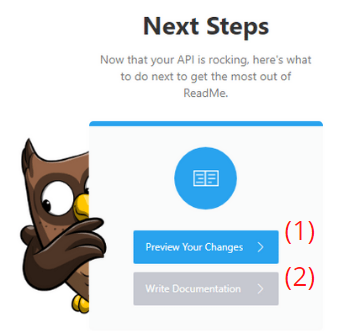

<aside>
⚠️ <b>Como tornar a documentação pública:</b>
Se este é o seu primeiro acesso ao readme, provavelmente você terá o acesso “trial” aos planos pagos. Para tornar a sua página de documentação acessível a qualquer um, você deve fazer o downgrade da página.
Para isso, acesse seu projeto no <b>Dashboard</b>. Selecione <b>Project</b> > <b>Configurations</b> > <b>Upgrade Plan</b> Na nova página que se abrirá, você deve selecionar o plano <b>Free</b>.
Pronto! Agora você pode compartilhar livremente o link para sua documentação com qualquer um.

</aside>

Podemos ver já algumas coisas bacanas. No menu esquerdo vemos a página “Getting Started With Your API” (1), criada já por padrão. Logo abaixo, temos uma documentação básica da nossa API (2) de acordo com o que foi informado no arquivo JSON que importamos, e também temos em (3), no topo da página, algumas customizações que fizemos lá no início, como a logo (VAIVOA) e domínio (treinamento-readme.readme.io) personalizados.

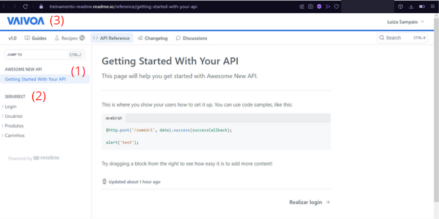

Navegando pela página, temos o painel de busca, à direita, que permite que o cliente pesquise facilmente os endpoints de interesse; e, expandindo o menu à esquerda, vemos que todos os endpoints documentados foram importados com sucesso:

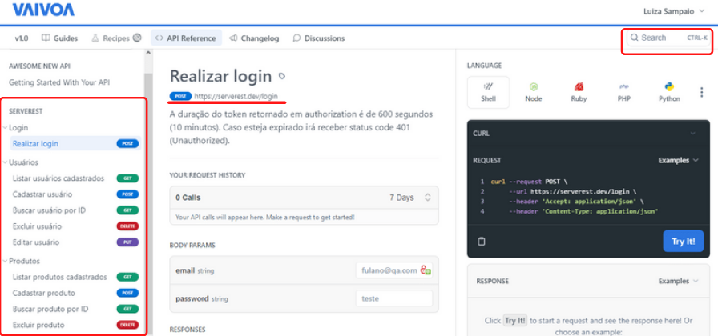

Já podemos inclusive fazer alguns testes de requisição através do botão “*Try It!*” à direita. Por padrão, o readme gera os comandos de request para algumas linguagens como Shell, Node, Ruby e etc. E você pode utilizar dados de exemplo (caso tenham sido descritos previamente no arquivo JSON):

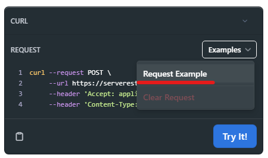 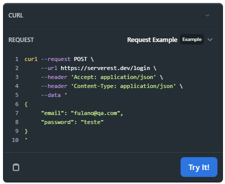

Ou entrar com seus próprios dados:

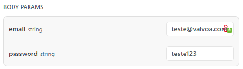 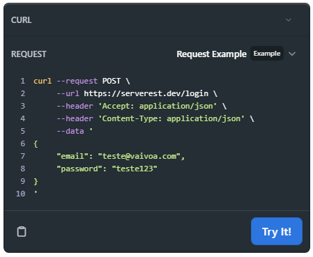

Ao clicar em “*Try It!*”, recebemos a reposta logo em baixo (figura à esquerda), e podemos ver também outros exemplos de resposta possíveis pelo endpoint (figura à direita).

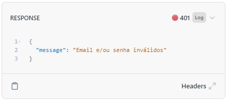 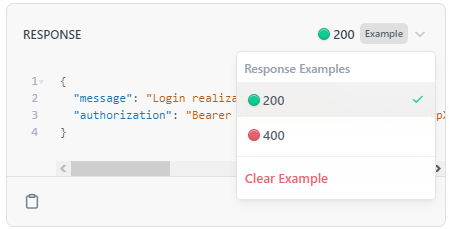

Vamos agora aprender como adicionar mais dados à estas páginas!


## Customizando a sua página no Readme

Voltando ao dashboard [https://dash.readme.com](https://dash.readme.com/), você deve ver um quadro com seus projetos, caso esteja logado. Vamos acessar o nosso projeto de teste novamente e navegar pelo menu à esquerda da tela, clicando em “*API Reference*”. Com isso, se abrirá um menu com todas as páginas de documentação criadas.

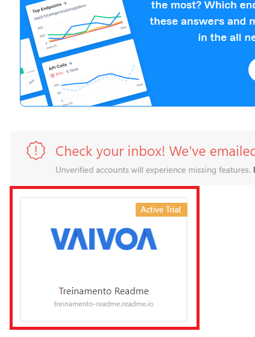 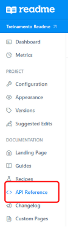 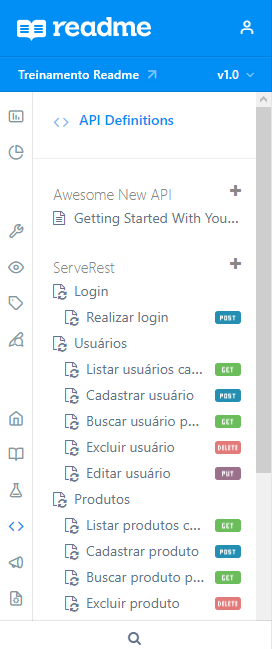

A plataforma readme permite a criação de páginas adicionais para a sua documentação, além de customizar as páginas existentes geradas na importação do Swagger. A criação, edição e remoção de páginas é bem simples, bastando clicar na página de interesse para editá-la ou mover o cursor sobre ela para ter opções como: adicionar subpágina, clonar e deletar página.

As paginas são feitas utilizando Markdown, mas é possível também incorporar elementos gráficos como tabelas e imagens diretamente pela plataforma Readme.

<aside>
⚠️ Uma das limitações de se importar um arquivo Swagger ou OpenAPI já pronto é que não podemos editar as saídas ou entradas de endpoints ou adicionar/editar exemplos de request e response, por exemplo.
Porém ainda podemos fornecer texto adicional às páginas dos endpoints, caso a documentação via Swagger esteja incompleta.

</aside>

Ao criar uma nova página, vemos a seguinte tela:

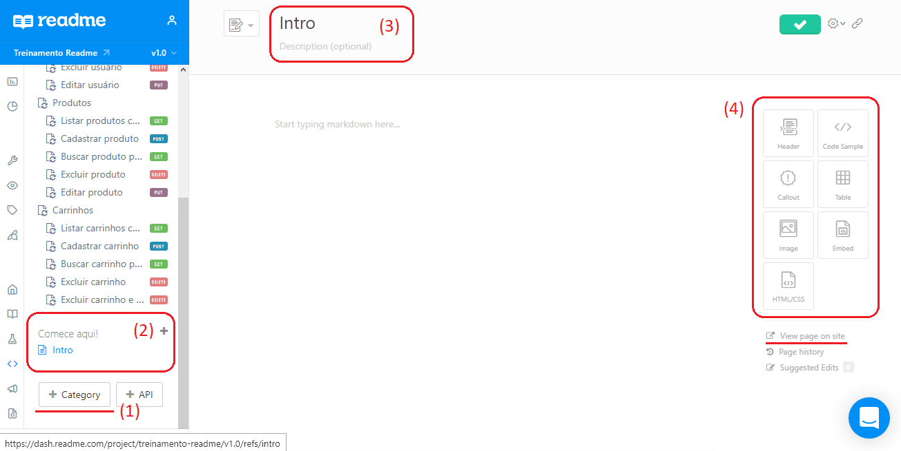

Na imagem, clicamos em “*+ Category*” (1) no menu de navegação de “*API Reference*” para criar uma nova sessão. Nesta sessão, clicamos no sinal de “+” para adicionar a nova página (2). Esta página pode ter seu nome e descrição alterados no topo da página (3).

Vemos à direita os recursos disponíveis para tornar seu texto mais atrativo para o usuário. Tais como:

- Headers, para destacar títulos em sumários;
- Code snipets, caso seja necessário introduzir trechos de códigos;
- Callout, para trechos em destaque com flags de info, atenção e etc;

Entre outras funcionalidades que tornarão sua documentação mais rica.

Voltando à imagem acima, assim que terminar suas edições, é possível visualizar suas alterações clicando em “*View page on site*” no canto inferior direito da tela. Só não esqueça de salvar antes no canto superior direito!

Bom, vamos dar uma olhada em uma página de Introdução construída no Readme:

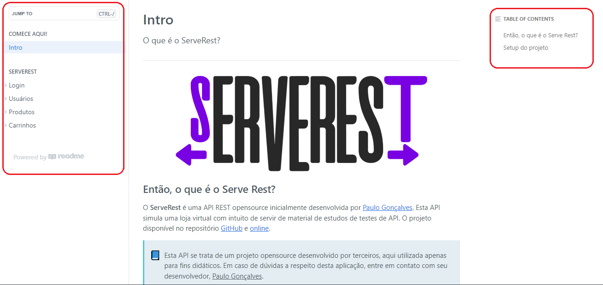

Vemos que além da documentação da API, podemos inserir páginas contendo explicações e instruções para usuários que não estejam tão ambientados ao projeto, por exemplo. Este usuário poderá navegar facilmente por toda a sua documentação através do menu de páginas à esquerda e do sumário à esquerda (que mostra as sessões em que você dividiu sua página utilizando os “*Headers*”, lembra?).

Agora é a sua vez!

### Criando uma página inicial

Na sessão API Reference, clique no ícone ao lado do nome da API ServeRest para criar uma nova página a nomeie "Início".


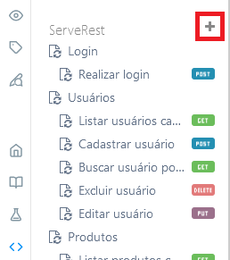

Em seguida adicione os seguintes componentes ao corpo da página:

  - Um badge com um link para o [repositório](https://github.com/ServeRest/ServeRest) do projeto utilizando a ferramenta [Shields](https://shields.io/).
    
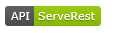
    
- Uma breve descrição do projeto.
- Um *Callout* do Readme informando a finalidade da sua documentação.

    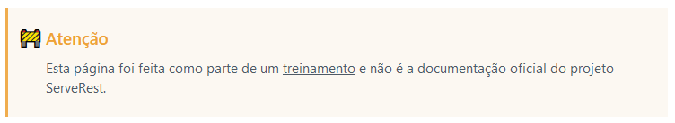

Quando concluir, não se esqueça de salvar as alterações.

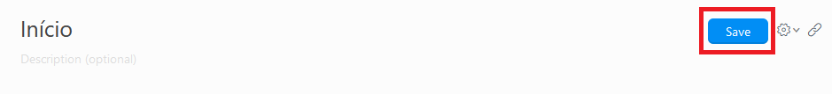

### Customizando páginas

Selecione a página “Usuários”, que representa um dos *Controllers* da API.

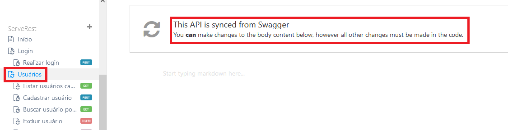

Note que esta página é gerada a partir do Swagger mas é possível customiza-la adicionando novos elementos.

Adicione os seguintes componentes ao corpo da página:

- [ ]  Uma descrição da função do *Controller* Usuários.
- [ ]  Uma descrição dos atributos no modelo Usuário.

Gostou destas customizações? No próximo tópico vamos ensinar a fazer algumas customizações de layout da página para tornar tudo mais profissional.

## Ajustes finos de layout

Neste tópico o nosso objetivo é somente mostrar como tornar seu site mais profissional. Voltamos novamente à barra de navegação do projeto à direita e clicamos em “*Appearance*”. No menu, o único recurso que realmente nos interessa é o “*Theme Editor*”, que está disponível na versão gratuita.

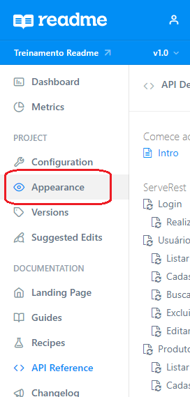 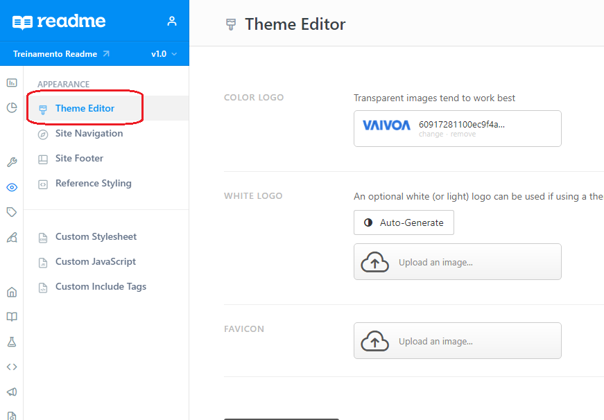

Nesta página encontramos recursos como: inserir logo, ícone de favoritos, mudar cor/imagem de fundo, cor da fonte e etc.

Veja agora uma comparação entre a nossa página antes e depois das modificações.

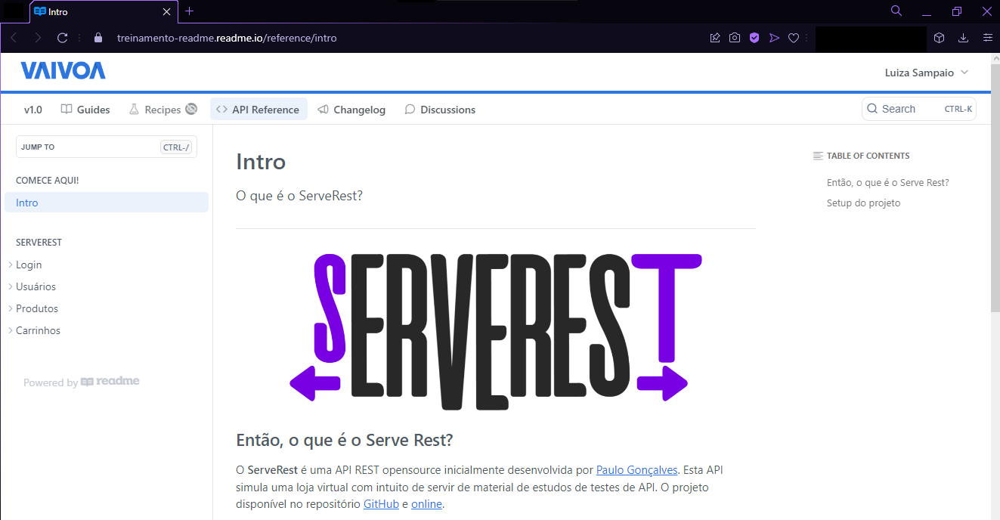

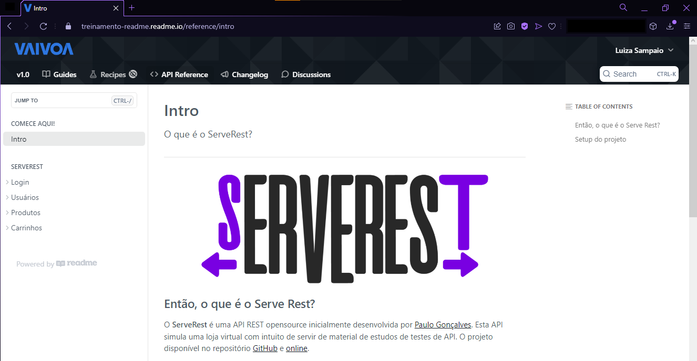

Já deu outra cara, não? 😉


<!--  TODO: Revisar este capítulo, pois o texto no notion foi deletado
## Outros recursos para explorar

### Versionamento

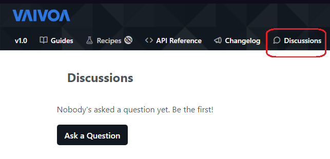

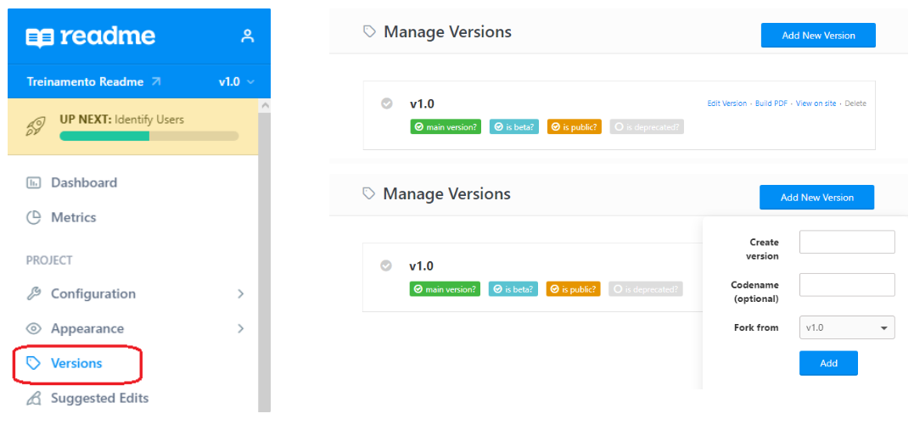

### Fórum de perguntas

Na imagem abaixo, acessando “*Page Views*” por exemplo, conseguimos ver como se dá os acessos nas páginas de documentação em um certo período de tempo. Além de conseguir observar granularidades como quais usuários estão acessando mais a documentação e quais as páginas estão sendo mais vistas.

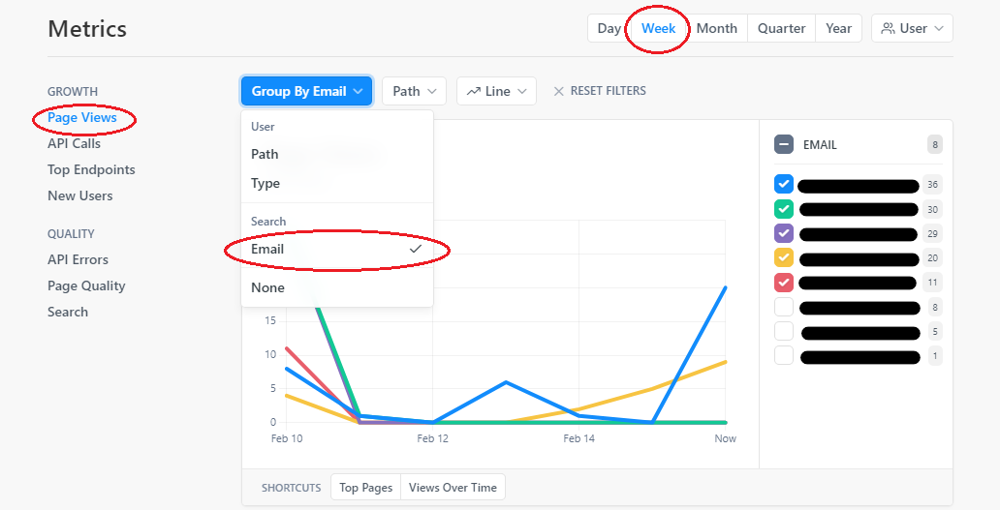

Nas métricas de “*API Calls*” também conseguimos tirar várias informações interessantes.

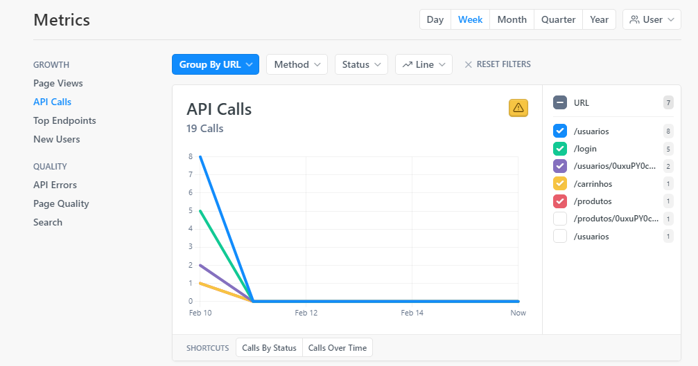

É possível checar quais endpoints estão sendo mais acessados, ou mais especificamente quais métodos (GET, POST, DELETE, etc). Também é possível observar se os usuários estão gerando muitos erros, gerando muitas respostas de código 400 ou não, entre outras possibilidades.

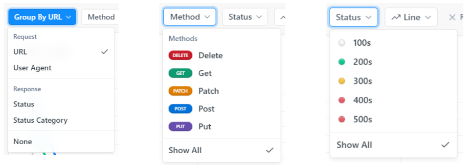


E caso apareça algo muito estranho nos gráficos, você ainda pode averiguar mais detalhadamente quando estas respostas estão sendo geradas através dos logs registrados abaixo de cada gráfico.

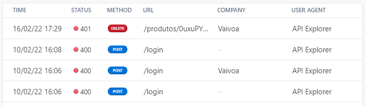

Através dessas informações, é possível entender que usuários estão tendo mais dificuldades com a documentação ou quais páginas de repente precisam de mais detalhamento ou reformulação. Melhorando cada vez mais a documentação de sua API!

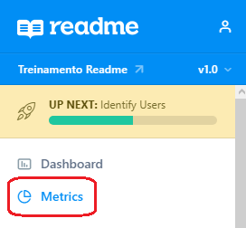 -->

## Conclusão

Parabéns! Você concluiu mais um treinamento e agora está preparado para criar uma documentação profissional com o Readme e melhorar a experiência dos usuários da sua API.

### Saiba mais

- [Documentação do Readme](https://docs.readme.com/docs)
- [Documentação do Swagger](https://swagger.io/docs/)